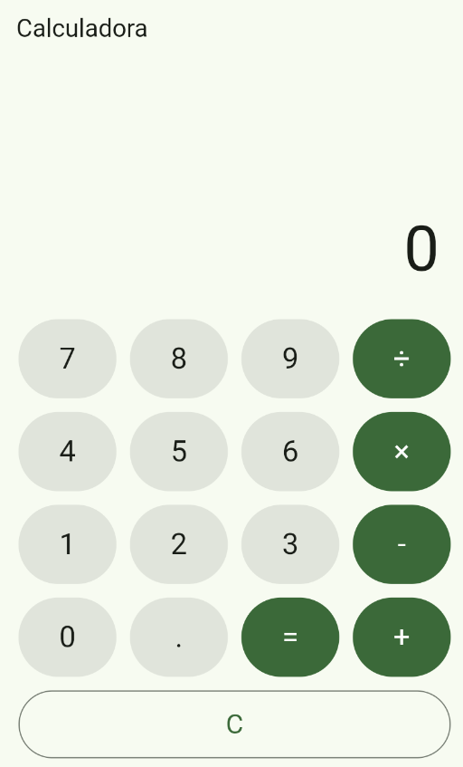

# 🧮 Calculadora Flutter

Aplicativo de calculadora desenvolvido em **Flutter** como atividade acadêmica do curso de **Sistemas de Informação** do **Instituto Federal Goiano – Campus Urutaí**.

O projeto aplica os conceitos vistos em aula: **StatefulWidget**, **StatelessWidget**, **setState**, **callbacks** e **separação do código em widgets reutilizáveis**.

---

## ✨ Funcionalidades

- Operações básicas: **soma (+)**, **subtração (-)**, **multiplicação (×)** e **divisão (÷)**
- Números decimais (botão `.`)
- Botão **C** para limpar o visor
- Botão **=** para calcular o resultado
- Interface em Material Design 3 com tema verde
- Layout responsivo, funcionando em celular e no navegador

---

## 📸 Preview
>
> 

---

## 🗂️ Estrutura do projeto

```
lib/
├── main.dart                        # Ponto de entrada e configuração do MaterialApp
├── pages/
│   └── calculadora_page.dart        # Tela principal: estado (setState) e lógica das operações
└── widgets/
    ├── visor.dart                   # Exibe o valor atual (StatelessWidget)
    ├── teclado.dart                 # Monta a grade de botões e o botão C
    └── botao_calculadora.dart       # Botão reutilizável
```

### Como os componentes se comunicam

O **estado fica no widget pai** (`CalculadoraPage`). Os widgets filhos não guardam estado: eles recebem dados e funções pelo construtor.

| Widget | Responsabilidade |
|---|---|
| `CalculadoraApp` | Configura o `MaterialApp`, o tema e a tela inicial |
| `CalculadoraPage` | Guarda o estado, executa `setState` e calcula as operações |
| `Visor` | Mostra o texto recebido da página |
| `Teclado` | Organiza os botões e avisa a página por *callbacks* (`onTecla` e `onLimpar`) |
| `BotaoCalculadora` | Botão genérico reaproveitado em todo o teclado |

---

## 🛠️ Tecnologias

- [Flutter](https://flutter.dev) 3.47.5
- [Dart](https://dart.dev) 3.13.4
- Material Design 3

---

## 🚀 Como executar

### Pré-requisitos

- [Flutter SDK](https://docs.flutter.dev/get-started/install) instalado e no PATH
- [Git](https://git-scm.com)
- Google Chrome (para rodar no navegador) ou um emulador/dispositivo Android

> ⚠️ **Dica para Windows:** instale o Flutter em um caminho **sem acentos e sem espaços** (por exemplo, `C:\src\flutter`). Caminhos como `Área de Trabalho` causam erro na compilação dos shaders.

### Passo a passo

```bash
# 1. Clone o repositório
git clone URL_DO_REPOSITORIO

# 2. Entre na pasta do projeto
cd flutter_calculadora

# 3. Baixe as dependências
flutter pub get

# 4. Execute no Chrome
flutter run -d chrome
```

Para rodar em um emulador ou celular Android, use `flutter devices` para listar os dispositivos e `flutter run` para executar.

---

## 📚 Contexto acadêmico

Projeto desenvolvido para a disciplina **NOME_DA_DISCIPLINA**, sob orientação do(a) professor(a) **NOME_DO_PROFESSOR**.

---

## 📄 Licença

Projeto de finalidade educacional.
